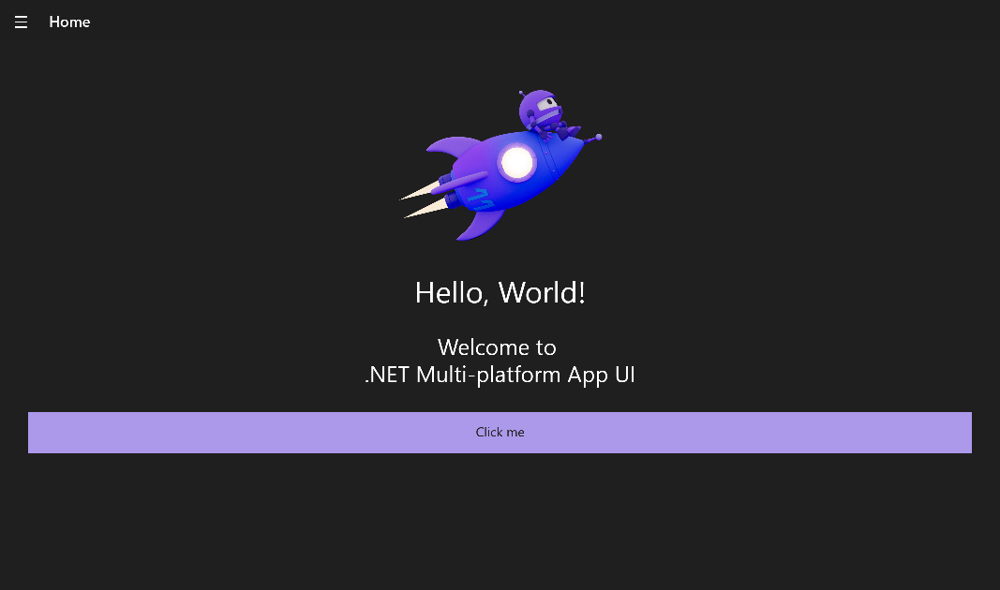
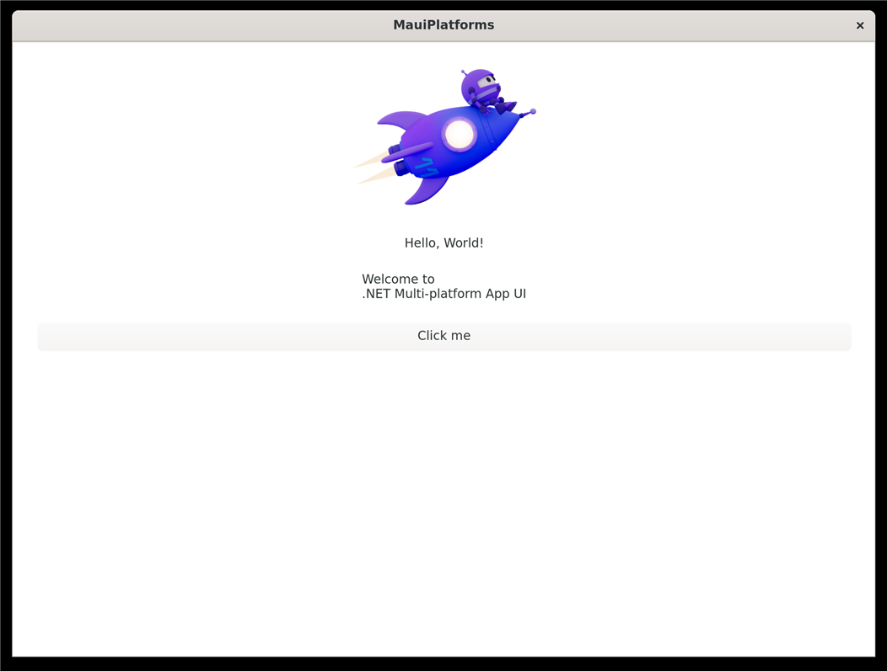

# maui-platforms

[](https://github.com/oughnic/maui-platforms/actions/workflows/build.yml)

A demonstrator for running the **default .NET MAUI app** on the three experimental desktop backends from
[dotnet/maui-labs](https://github.com/dotnet/maui-labs): **Windows WPF**, **Linux GTK4** and **macOS AppKit**.
It exists to understand the current state of the art, not to ship anything, so every rough edge is recorded in
[docs/status.md](docs/status.md) rather than worked around silently.

Everything runs on the latest **.NET 11 / MAUI 11 release candidate** (`global.json` pins the SDK) with the labs
packages taken from nuget.org.

## Status

| Head | Target | Builds | Runs | DevFlow | Notes |
| --- | --- | :-: | :-: | :-: | --- |
| `MauiPlatforms.Wpf` | win-arm64 | ✅ | ✅ | ✅ | Default app renders correctly; DevFlow agent connects, screenshot/tree work, page content is not in the tree ([details](docs/status.md)) |
| `MauiPlatforms.Wpf` | win-x64 | ✅ | ➖ | ➖ | Cross-built on the arm64 machine and built natively by CI on `windows-latest`; not yet run on x64 hardware |
| `MauiPlatforms.Gtk4` | linux-arm64 | ✅ | ✅ | ❌ | Built and run in WSL2 Ubuntu 24.04 (GTK 4.14); renders the page but no Shell navigation bar; the labs GTK DevFlow agent targets the old backend package ([details](docs/status.md)) |
| `MauiPlatforms.Gtk4` | linux-x64 | ✅ | ➖ | ❌ | Cross-compiled and built natively by CI on `ubuntu-24.04`; not yet run on x64 hardware |
| `MauiPlatforms.MacOS` | osx-arm64 | ✅ | ⏳ | ⏳ | Builds in CI on `macos-26` (Xcode 26); run + DevFlow on an Apple Silicon Mac (Stepney) pending |
| `MauiPlatforms` (default app, WinUI) | win-arm64 | ✅ | ➖ | agent added | Windows TFM only; android/ios/maccatalyst need the full `maui` workload |

| WPF backend, win-arm64 | GTK4 backend, linux-arm64 (WSL2, WSLg) |
| --- | --- |
|  |  |

## What is here

| Path | Purpose |
| --- | --- |
| `src/MauiPlatforms/` | `dotnet new maui -f net11.0` output, untouched apart from the DevFlow agent registration in `MauiProgram.cs`. Its XAML, code and resources are shared by every head. |
| `src/MauiPlatforms.Wpf/` | WPF head: `net11.0-windows`, `UseWPF` + `UseMaui`, `Microsoft.Maui.Platforms.Windows.WPF` (+ Essentials, DevFlow WPF agent). |
| `src/MauiPlatforms.Gtk4/` | GTK4 head: plain `net11.0` console project (no MAUI workload needed), `Microsoft.Maui.Platforms.Linux.Gtk4` (+ Essentials). DevFlow is opt-in, see below. |
| `src/MauiPlatforms.MacOS/` | AppKit head: `net11.0-macos`, `Microsoft.Maui.Platforms.MacOS` (+ Essentials, DevFlow agent). Apple Silicon only. |
| `Directory.Build.props` | Single place for the labs package version (`MauiLabsVersion`) and the MAUI version used where no workload is present. |
| `eng/setup-windows.ps1`, `eng/setup-linux.sh`, `eng/setup-macos.sh` | Machine setup scripts (SDK, workloads, GTK4 packages, maui CLI, templates). |
| `.github/workflows/build.yml` | Build matrix: WPF on `windows-11-arm` + `windows-latest`, GTK4 on `ubuntu-24.04-arm` + `ubuntu-24.04`, AppKit on `macos-26`. |
| `.claude/` | Claude Code project settings (maui-labs plugin marketplace, permissions) and the DevFlow skills installed by `maui devflow init`. |
| `docs/status.md` | Findings, breakages and workarounds, with package versions. |

The heads follow the pattern used by `samples/DevFlow.Sample.*` in maui-labs: each is a thin project that **links**
the shared app's `*.cs`, `*.xaml` and `Resources/**` with wildcards and provides its own `MauiProgram.cs`, whose only
difference is the hosting call (`UseMauiAppWPF`, `UseMauiAppLinuxGtk4`, `UseMauiAppMacOS`).

## Versions in use

| Component | Version |
| --- | --- |
| .NET SDK | 11.0.100-rc.1.26425.128 (RC1, go-live, released 2026-09-08) |
| .NET MAUI | 11.0.0-rc.1.26451.6 (workload band 11.0.100-rc.1) |
| maui-labs backends + DevFlow | 0.1.0-preview.12.26421.1 |
| `maui` CLI (`Microsoft.Maui.Cli`) | 0.1.0-preview.12.26421.1 |
| Agent skills | `dotnet-maui` 0.6.0, `dotnet-maui-tooling` 0.1.0 from dotnet/maui-labs `main` |

The labs packages are compiled against **MAUI 10.0.41**; running them on MAUI 11 RC is deliberately part of the experiment.

## Setup

### Windows (arm64 or x64)

From an **elevated** PowerShell 7 prompt:

```powershell
pwsh -ExecutionPolicy Bypass -File eng\setup-windows.ps1            # full 'maui' workload (android/ios/maccatalyst/windows)
pwsh -ExecutionPolicy Bypass -File eng\setup-windows.ps1 -WindowsOnly # just maui-windows: enough for the WPF head and the default app's Windows target
```

This installs the pinned .NET 11 SDK from the official installer, the MAUI workload(s), the `maui` CLI and the labs
project templates. The .NET 11 RC1 announcement names Visual Studio 2026 Insiders (and VS Code with C# Dev Kit) as the
supported IDEs; the Visual Studio 2026 release channel installed here (18.10) is not listed, so expect to use the CLI or
Insiders for RC builds.

### Linux / WSL2 (GTK4 head)

GTK 4.12+ is required, so use Ubuntu 24.04 or newer (Ubuntu 22.04 ships 4.6, 20.04 has none). In WSL:

```powershell
wsl --install -d Ubuntu-24.04
```

then inside the distro:

```bash
bash eng/setup-linux.sh          # GTK4 + WebKitGTK dev packages, .NET 11 SDK into ~/.dotnet, maui CLI
dotnet run --project src/MauiPlatforms.Gtk4 -r linux-arm64   # or linux-x64
```

WSLg shows the GTK window on the Windows desktop. Build from a Linux-filesystem copy of the repo (`~/maui-platforms`),
not `/mnt/c/...`, so `bin/`/`obj/` do not collide with the Windows builds.

### macOS (AppKit head)

Apple Silicon Mac with Xcode 26. `eng/setup-macos.sh` installs the pinned .NET 11 SDK into `~/.dotnet` (no sudo),
the workloads and the `maui` CLI:

```bash
bash eng/setup-macos.sh            # macos + maui-tizen workloads
bash eng/setup-macos.sh --mobile   # additionally the full maui workload for the default app's iOS/Mac Catalyst targets
```

A `UseMaui` project on `net11.0-macos` needs the `macos` workload plus the MAUI SDK packs, which the SDK resolves to the
small `maui-tizen` workload (`maui` works too, at several times the download). Then:

```bash
dotnet build src/MauiPlatforms.MacOS
dotnet run --project src/MauiPlatforms.MacOS
```

## Running the heads

```bash
dotnet run --project src/MauiPlatforms.Wpf                     # Windows, host architecture
dotnet build src/MauiPlatforms.Wpf -r win-x64                  # x64 build on an arm64 machine (runs under emulation)
dotnet build src/MauiPlatforms -f net11.0-windows10.0.19041.0 -p:TargetFrameworks=net11.0-windows10.0.19041.0
dotnet run --project src/MauiPlatforms.Gtk4 -r linux-arm64     # Linux
dotnet run --project src/MauiPlatforms.MacOS                   # macOS
```

`dotnet build MauiPlatforms.slnx` is not expected to succeed on any single OS: each head needs its own operating system.
Build per project (that is what CI does).

## Tooling

- **maui CLI**: `maui doctor`, `maui devflow …`, `maui device list`. Update with `dotnet tool update -g Microsoft.Maui.Cli --prerelease`.
- **DevFlow**: all heads register `AddMauiDevFlowAgent()` in Debug builds. Typical loop:

  ```bash
  maui devflow broker start
  dotnet run --project src/MauiPlatforms.Wpf
  maui devflow list
  maui devflow ui tree --depth 3
  maui devflow ui screenshot --output shot.png
  maui devflow mcp        # same capabilities as an MCP server for AI agents
  ```

  On GTK4, DevFlow is opt-in (`dotnet build src/MauiPlatforms.Gtk4 -p:MauiGtk4DevFlow=true`) because the GTK agent
  package still depends on the superseded `Platform.Maui.Linux.Gtk4` package; see [docs/status.md](docs/status.md).
- **Agent skills**: `.claude/settings.json` registers the maui-labs marketplace and enables `dotnet-maui` and
  `dotnet-maui-tooling`; Claude Code offers to install them when the folder is opened. `maui devflow init` keeps the
  three `maui-devflow-*` skills in `.claude/skills` in step with the installed CLI (`maui devflow skills check`).
- **Templates**: `maui-wpf` and `maui-linux-gtk4` are installed by the setup scripts (`dotnet new maui-wpf`, `dotnet new maui-linux-gtk4`).
  There is no published macOS template package; `src/MauiPlatforms.MacOS` was hand-built from `platforms/MacOS/templates` in maui-labs.

## Findings

See [docs/status.md](docs/status.md) for everything that broke, why, and the workaround applied.
